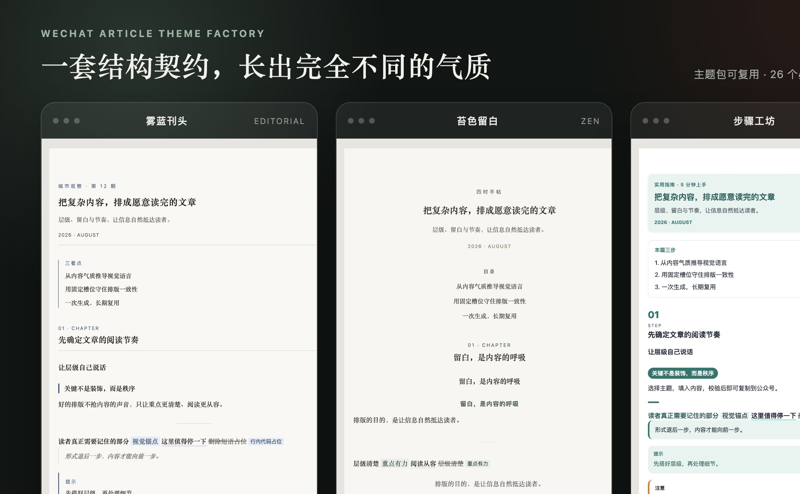
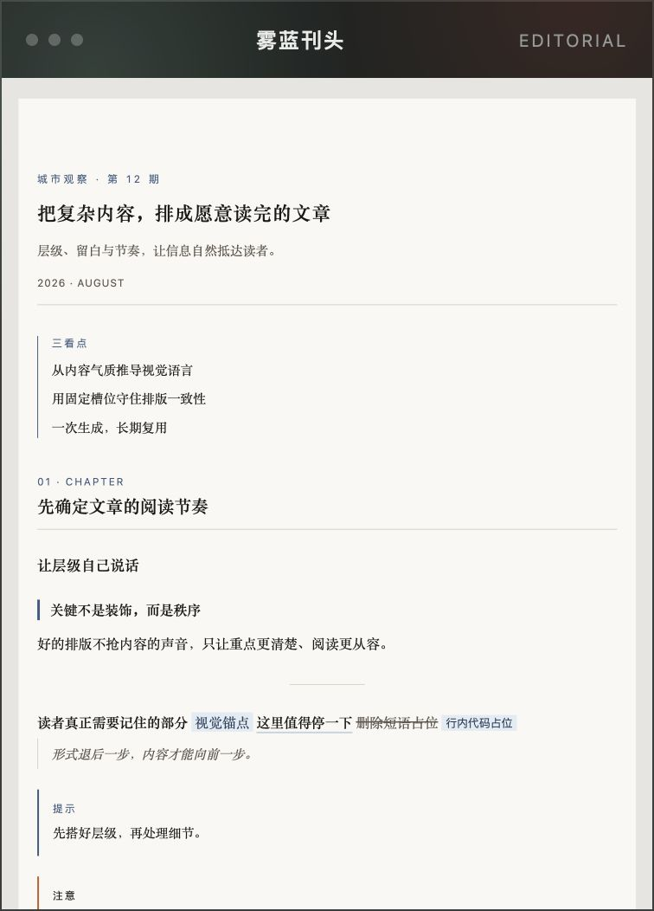
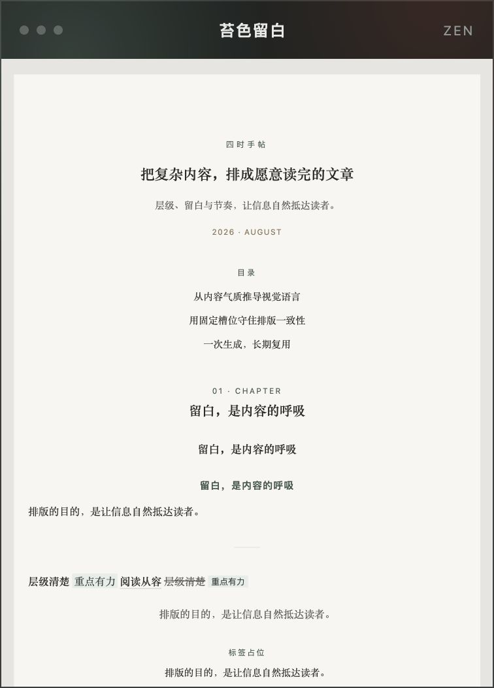
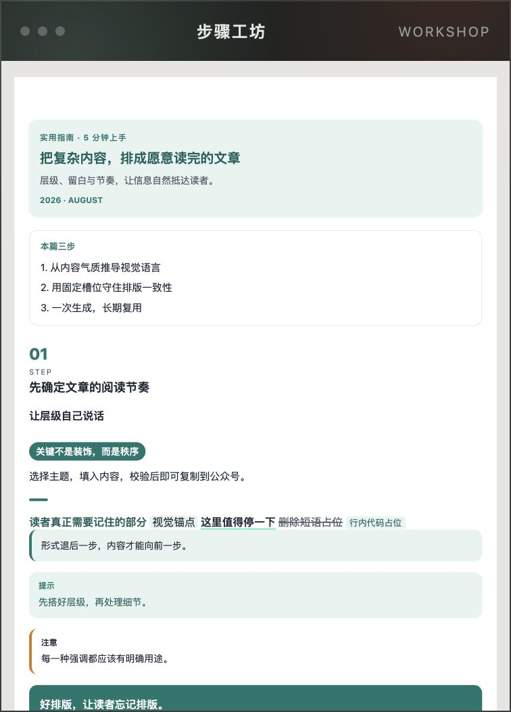

# gzh-beautify-skill · 公众号排版主题工厂

**先生成一套符合内容气质的公众号主题，再用它把 Markdown 排成可直接粘贴的微信图文。**

不需要自己写 HTML，也不需要先从主题列表里挑模板。告诉 Agent 想要的感觉，确认预览后，这套主题就能反复使用。

[](LICENSE)



<p align="center"><sub>同一套结构契约，可以生长出杂志感、东方留白与实用教程等不同气质。</sub></p>

<table>
  <tr>
    <td width="33%" align="center"><br><sub>雾蓝刊头 · 克制杂志感</sub></td>
    <td width="33%" align="center"><br><sub>苔色留白 · 东方长呼吸</sub></td>
    <td width="33%" align="center"><br><sub>步骤工坊 · 清晰行动感</sub></td>
  </tr>
</table>

## 先看懂整个流程

一次完整使用分为两段：先把主题做出来，再拿主题排文章。

```text
描述气质或提供参考图
        ↓
生成主题预览 → 你确认或提出修改
        ↓
主题包入库
        ↓
提供 Markdown → 生成公众号 HTML → 复制到公众号编辑器
```

主题只需要生产一次。以后排同一系列的文章，可以直接复用，不必每篇重新设计。

## 第一次使用：从主题到成稿

### 1. 安装 skill

在支持 skills 的 Agent 环境中运行：

```bash
npx skills add https://github.com/TwinWrite/gzh-beautify-skill
```

运行环境需要 Node.js/npm 来安装 skill，并需要 Python 3 执行产物校验。也可以把本仓库 clone 到 Agent 的 skills 目录。安装完成后，后续操作都可以直接在 Agent 对话中用自然语言完成。

### 2. 生成第一套主题

给出一段气质描述。颜色和字体不是必填项，不知道怎么选时让 Agent 推导即可。

可以直接复制这段：

> 为我的公众号生成一套排版主题。内容以产品与技术观察为主，希望是雾蓝杂志感、细线分隔、衬线标题，整体克制、留白充足。

也可以提供参考截图：

> 参考这张图的颜色、留白、线条和信息密度，生成一套新的公众号主题。不要复刻原文案、Logo 或组件。

Agent 会先写入：

```text
themes/{id}/
├── theme.json    # 主题的结构、颜色与字体
└── preview.html  # 整页视觉预览
```

### 3. 查看并确认预览

用浏览器打开 `preview.html`，重点看整体气质、标题层级、正文节奏和强调样式。

满意时回复：

> 这个方向可以，确认并完成主题包。

需要调整时直接描述感受，例如：

> 标题再克制一点，正文留白增加，强调色不要这么亮。

确认后，Agent 才会编译完整的 `THEME.md` 并运行主题校验：

```text
themes/{id}/
├── theme.json
├── preview.html
└── THEME.md      # 可复用的排版槽位、骨架与映射规则
```

### 4. 用主题排一篇文章

准备好 Markdown 文件后，对 Agent 说：

> 用 `{id}` 主题把 `article.md` 排成公众号 HTML。

Agent 会读取已经确认的主题，只填入文章内容，不再临时发明另一套样式。最终得到：

```text
article_排版_{主题中文名}({id}).html       # 干净正文
article_排版_{主题中文名}({id})_预览.html  # 带复制按钮的预览页
```

### 5. 复制到公众号

打开带 `_预览.html` 的文件，检查成品后点击「复制到公众号」，再粘贴进微信公众号编辑器。

如果复制按钮不可用，也可以使用旁边的干净正文 HTML 作为兜底。工具条只存在于预览页，不会混进文章正文。

## 已经有主题包？

可以跳过主题生产，直接提供主题路径和文章：

> 用 `themes/my-theme/` 把 `article.md` 转成公众号 HTML。

主题查找顺序为：用户提供的路径 → 当前项目的 `themes/{id}/` → skill 内的 `themes/{id}/`。

如果只说“排一下这篇文章”但还没有主题，Agent 会先根据文章气质生产主题，再进入排版流程。

## 为什么不是「主题超市」？

常见排版工具先内置很多风格，让用户挑一套接近的模板。这个 skill 反过来：

1. **主题包是主产物**：每套主题都拥有自己的结构模型、色板和完整槽位。
2. **预览先于入库**：先确认视觉方向，再把它编译成可长期复用的主题。
3. **结构保证稳定**：26 个必选槽覆盖常见 Markdown 内容，不会只在示例文章上好看。
4. **签名槽表达个性**：刊头、步骤条、手记栏等特征来自内容气质，而不只是换颜色。
5. **渲染不再即兴设计**：使用主题时只填槽，保证同一系列文章风格一致。

公众号编辑器会清洗外链 CSS、剥离 `id`，并丢弃部分样式。主题因此不是普通 CSS 文件，而是一套符合微信限制的内联 HTML 槽位。详细约束见 [`references/wechat-constraints.md`](references/wechat-constraints.md)。

## 示例主题是什么？

[`examples/themes/`](examples/themes/) 中有 6 套工厂冒烟示例，用来证明不同结构模型都能生成完整主题包，并帮助开发者理解产物格式。

它们**不是内置主题货架，也不会被渲染流程自动选中**。想要“教程绿卡”“石墨极简”或“禅意留白”时，Agent 会根据这些气质重新生产属于当前项目的主题。

## 输入与输出速查

| 你提供 | Agent 执行 | 你得到 |
|---|---|---|
| 气质描述或参考图 | 生产主题 | `theme.json` + `preview.html`，确认后补全 `THEME.md` |
| Markdown + 已有主题 | 渲染文章 | 干净正文 HTML + 带复制按钮的预览 HTML |
| Markdown，但没有主题 | 先生产、确认，再渲染 | 新主题包 + 排版后的文章 |

## 常见问题

### 必须会 HTML 或 CSS 吗？

不需要。正常使用只需描述视觉气质、确认预览并提供 Markdown。HTML 约束和校验由 skill 处理。

### 可以用参考图做主题吗？

可以。skill 会提取颜色、留白、线条、密度与情绪，不会复制对方的文案、Logo 或组件代码。

### 修改主题后，旧文章会自动变化吗？

不会。已经生成的文章 HTML 是独立产物。修改主题后，需要重新渲染文章才能应用新样式。

### 哪个文件才是最终正文？

不带 `_预览` 的 HTML 是干净正文；带 `_预览` 的文件用于浏览和一键复制。通常直接打开预览页操作最方便。

### 为什么不能直接用示例主题？

示例用于验证工厂能力，不参与主题发现。这样可以避免仓库逐渐变成越来越长的预设主题目录，也能保证每套正式主题都来自当前内容的真实需求。

## 开发与校验

下面的命令主要面向维护 skill 或手动检查产物的开发者。普通使用时由 Agent 自动执行，无需逐条运行。

```bash
python3 scripts/selftest.py
python3 scripts/lint_theme.py themes
python3 scripts/lint_theme.py examples/themes
python3 scripts/validate_article.py --strict <正文.html>
python3 scripts/wrap_preview.py <正文.html>
```

- `lint_theme.py`：检查主题 JSON 契约、对比度、缺失槽位和禁用 HTML。
- `validate_article.py`：检查公众号平台红线、`span[leaf]` 和中文标点。
- `wrap_preview.py`：给干净正文套上本地预览壳与复制按钮。
- `selftest.py`：运行仓库内置测试。

## 项目结构

```text
gzh-beautify-skill/
├── SKILL.md             # Agent 的工作流入口
├── references/          # 平台约束、设计系统、主题契约与渲染合同
├── scripts/             # 主题及文章校验工具
├── assets/              # 预览壳、试排稿与 README 图片
├── examples/themes/     # 工厂冒烟示例，不参与主题发现
└── themes/              # 正式主题输出目录，默认可以为空
```

更完整的主题包说明见 [`references/theme-schema.md`](references/theme-schema.md)，贡献与契约修改说明见 [`CONTRIBUTING.md`](CONTRIBUTING.md)。

## License

MIT © 2026 TwinWrite
